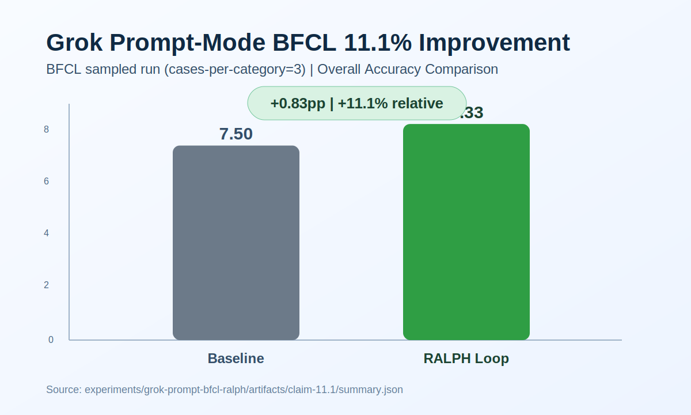
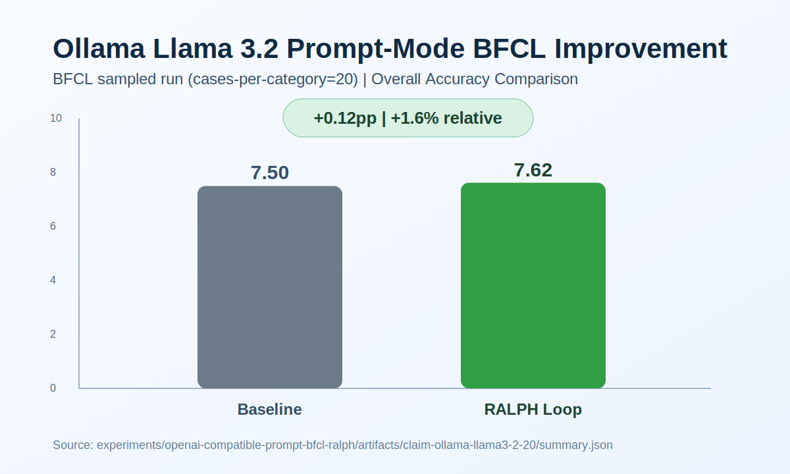

# Confirmed Tool-Calling Gains

이 문서는 `체크인된 아티팩트`로 다시 확인 가능한 BFCL prompt-mode 향상 사례만 모아둡니다.

## Benchmark basis

- Benchmark: `BFCL v4` (`Berkeley Function Calling Leaderboard`)
- Mode: `prompt-mode function calling`
- Comparison: `baseline prompt` vs `RALPH loop prompt`
- Headline metric: `Overall Acc`
- Categories used in the checked-in claims:
  - `multiple`
  - `parallel`
  - `parallel_multiple`
  - `simple_python`

## Confirmed gains

| Model | Provider | Cases / category | Baseline | RALPH | Delta (pp) | Relative delta |
|---|---|---:|---:|---:|---:|---:|
| `grok-4-latest` | xAI | 3 | 7.50 | 8.33 | +0.83 | +11.1% |
| `llama3.2:latest` | Ollama | 20 | 7.50 | 7.62 | +0.12 | +1.6% |

## Evidence links

- Grok
  - Summary: `experiments/grok-prompt-bfcl-ralph/artifacts/claim-11.1/summary.json`
  - Report: `experiments/grok-prompt-bfcl-ralph/artifacts/claim-11.1/benchmark_report.md`
  - CSV: `experiments/grok-prompt-bfcl-ralph/artifacts/claim-11.1/data_overall.csv`
  - Chart: `experiments/grok-prompt-bfcl-ralph/artifacts/claim-11.1/benchmark-11.1.svg`
- Ollama Llama 3.2
  - Summary: `experiments/openai-compatible-prompt-bfcl-ralph/artifacts/claim-ollama-llama3-2-20/summary.json`
  - Report: `experiments/openai-compatible-prompt-bfcl-ralph/artifacts/claim-ollama-llama3-2-20/benchmark_report.md`
  - CSV: `experiments/openai-compatible-prompt-bfcl-ralph/artifacts/claim-ollama-llama3-2-20/data_overall.csv`
  - Chart: `experiments/openai-compatible-prompt-bfcl-ralph/artifacts/claim-ollama-llama3-2-20/benchmark-ollama-llama3-2-20.svg`

## Charts

### Grok

### Ollama Llama 3.2

